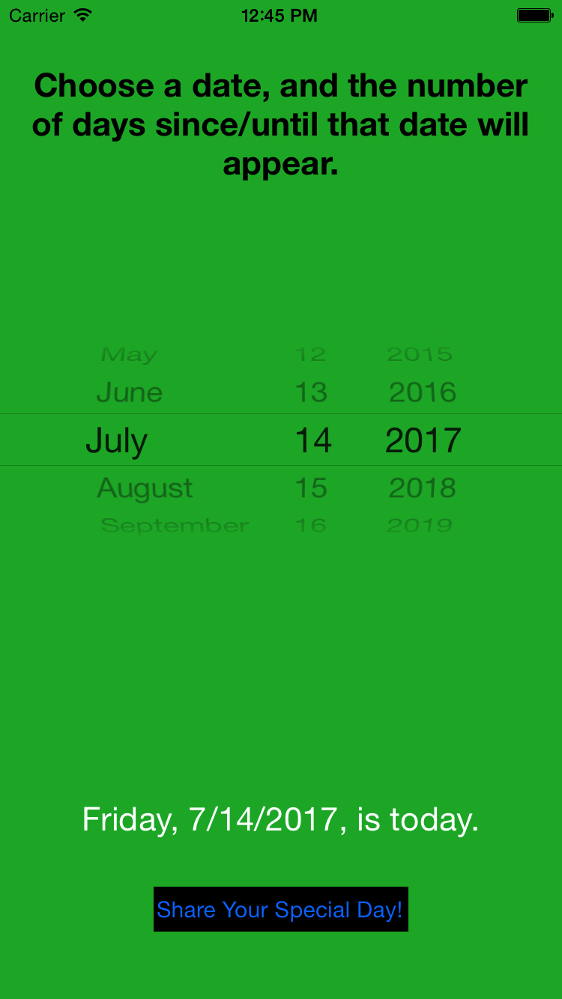
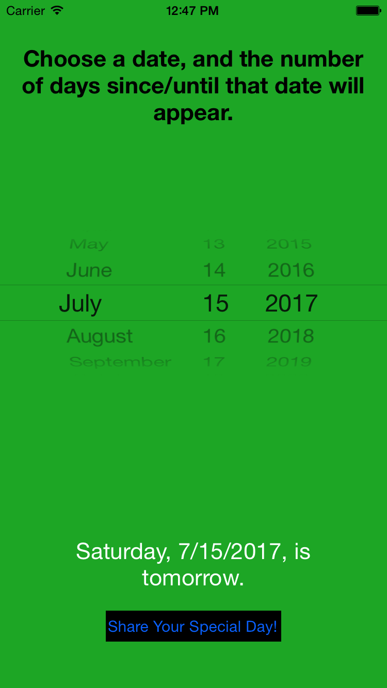
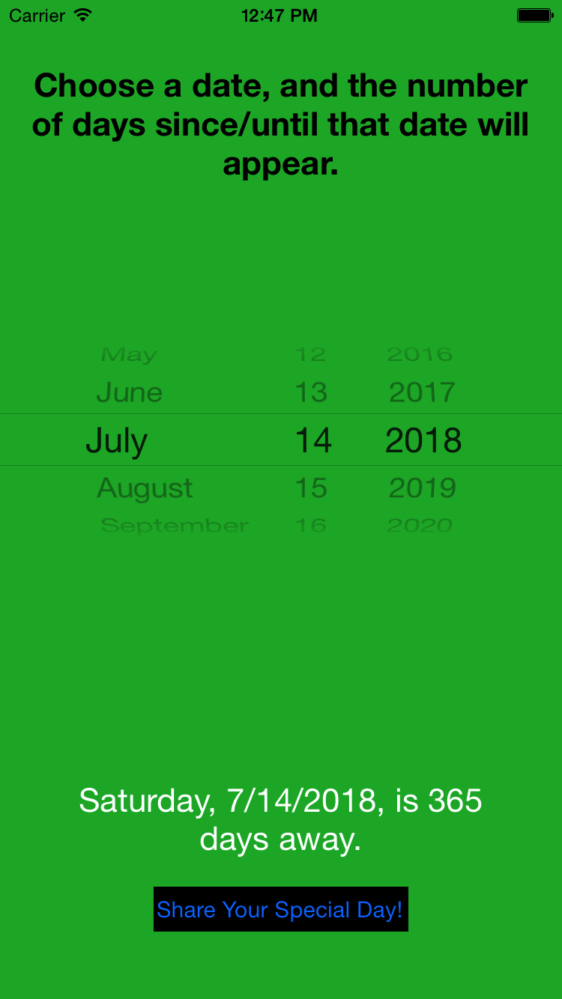
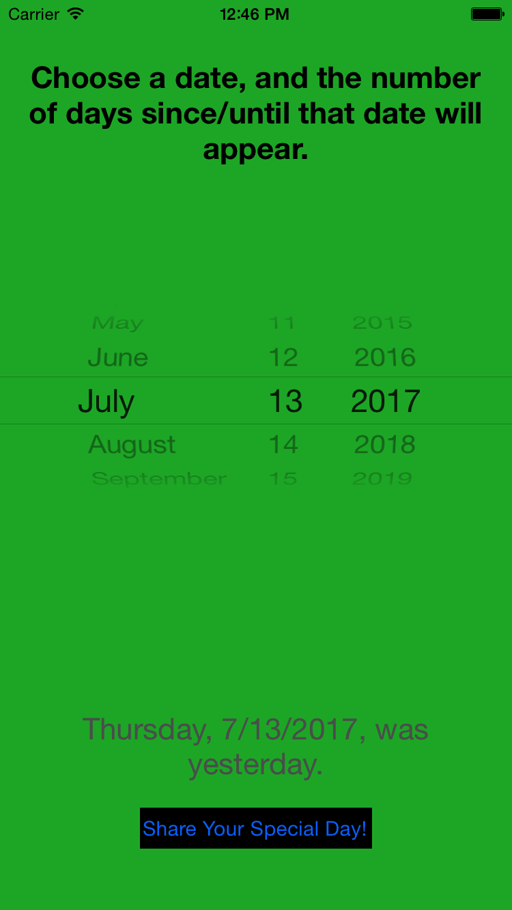
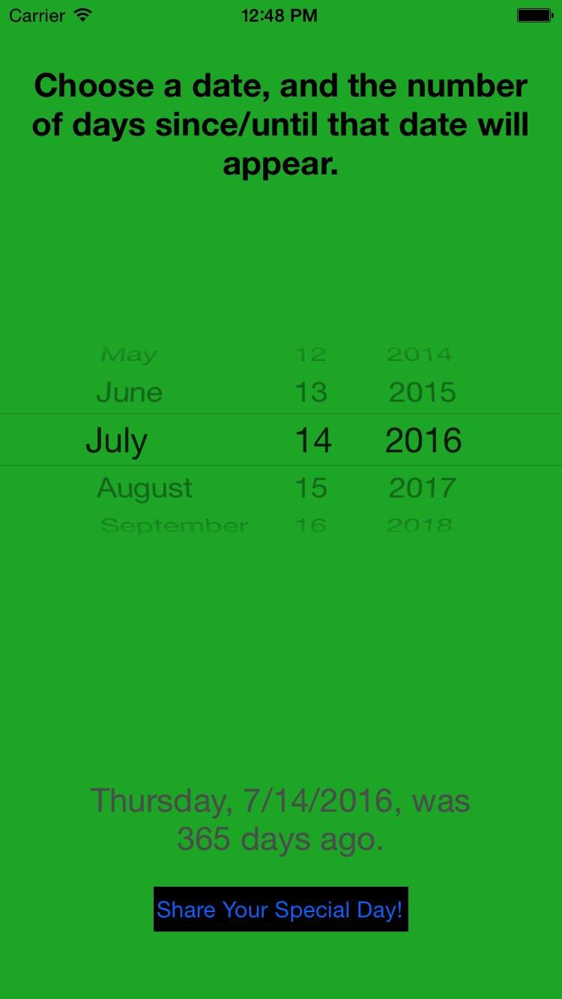
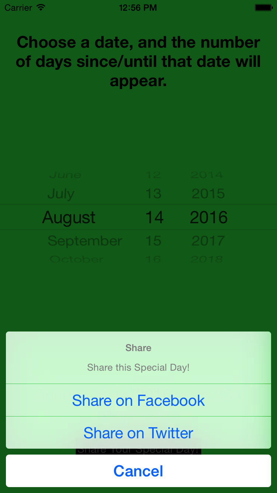

# Special Days

Special Days is an app for checking how many days there are between now and a particular date in the past or future.

The user can share the number of days since/until their Special Day on Twitter or Facebook. The default share message is different dependent on if the chosen date is 2 or more days in the past, the previous day, the current day, tomorrow, or 2 or more days in the future.

### Screenshot

### Works on
 The app is written in Swift 3, so it should run on any device running iOS 8 or later.

### Artwork
  Reem Lent designed the app icon
